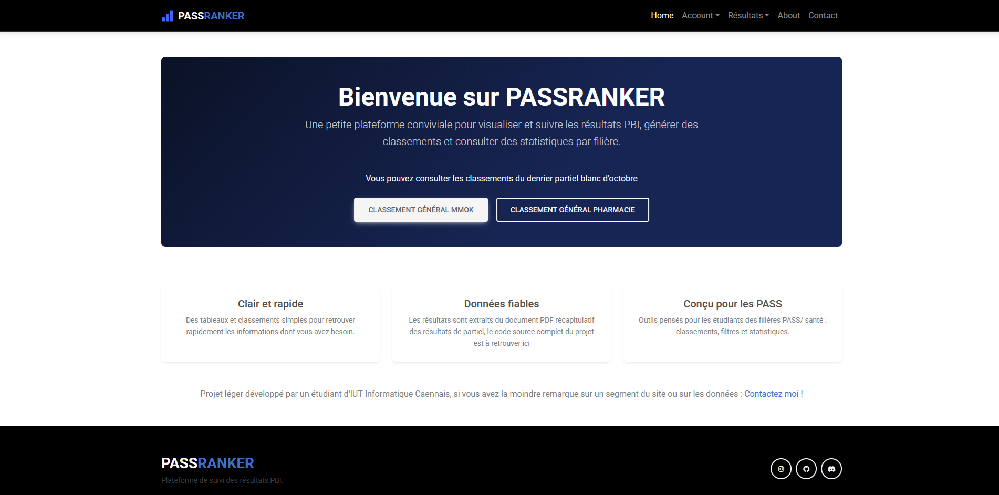
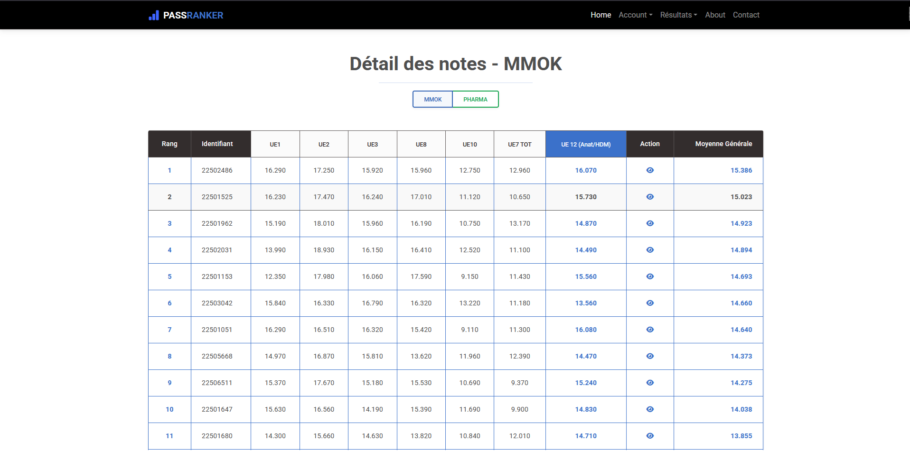

# Pass-Ranker

**Statut : Projet arrêté et archivé**

Outil de visualisation et de classement des résultats pour les partiels de PASS blanc du Tutorat de l'Université de Rouen --> S1 de l'année 25-26 (filières MMOK et Pharmacie). Ce projet a été conçu pour automatiser l'affichage des notes et des rangs à partir d'une base de données SQL.

---

## Stack Technique
* **Langage :** PHP 8
* **Gestion des dépendances :** Composer
* **Base de données :** MySQL (via mysqli)
* **Configuration :** PHP Dotenv pour la gestion des variables d'environnement
* **Interface :** Bootstrap 5+ HTML CSS JS classique

## Fonctionnalités
* Affichage dynamique des classements par filière.
* Calcul automatisé des rangs selon la moyenne générale.
* Structure modulaire (utilisation de require/include pour les composants réutilisables).
* Sécurisation des accès BDD via fichier .env.

## Contenu du dépôt
* **index.php** : Page d'accueil et présentation.
* **mmok.php** : Logique d'extraction et d'affichage du classement MMOK.
* **login.php / stats.php** : Squelettes de fonctionnalités non finalisées.
* **includes/** : Composants d'interface (header, footer, head) et utilitaires.

---
Projet réalisé par Thomas .C 
